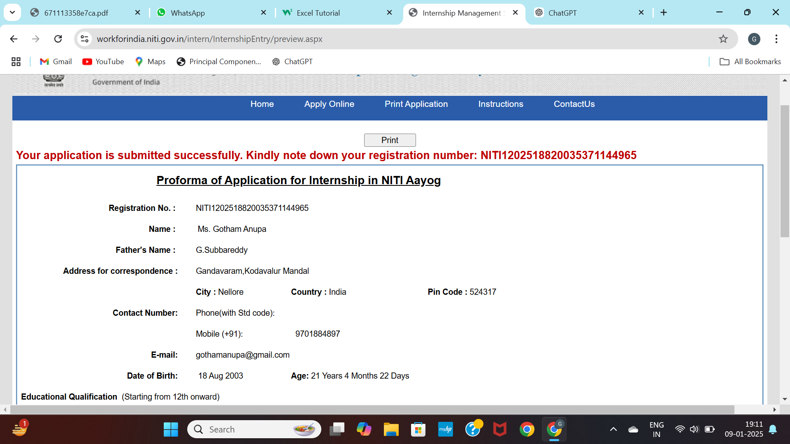

# Pulse – Emotionally Intelligent To-Do App

> *"An app that knows your energy, adapts to your mood, and helps you focus on what matters - because you're not a machine."*

## 📸 Screenshots

### Main Interface


### Task Management


### Energy Check-in


### Focus Timer


---

## 🌟 Features

### 🎯 Energy-Based Task Management
- **5 Mood States**: Energized 🔥, Focused 💪, Steady 🌊, Tired 🌙, Struggling 😔
- **Adaptive UI**: Entire app theme changes based on your mood
- **Smart Suggestions**: Task recommendations match your current energy level

### 🙏 Daily Shloka
- Curated Sanskrit verses from Bhagavad Gita, Upanishads, and Vedas
- English transliteration and meaning
- Daily wisdom for spiritual growth

### 💬 Mood Chatbot
- Opens with "Namaste! How was your day?"
- Detects your mood from text
- Provides empathetic responses and suggestions
- Emotional support when you need it most

### ⚡ AI Task Breakdown
- Automatically splits complex tasks into manageable subtasks
- Energy level suggestions for each task
- Category organization (Work, Personal, Health, Creative)

### ⏱️ Focus Timer
- Pomodoro-style timer
- Duration adapts to your energy level
- Beautiful circular progress visualization

### 📊 Weekly Insights
- Track your productivity
- See completion rates
- Motivational weekly summaries

---

## 🛠️ Tech Stack

| Technology | Purpose |
|------------|---------|
| React 18 | UI Framework |
| TypeScript | Type Safety |
| Vite | Fast Build Tool |
| Tailwind CSS | Styling |
| Zustand | State Management |
| Framer Motion | Animations |
| Phosphor Icons | Icon Library |

---

## 🚀 Quick Start

```bash
# Install dependencies
npm install

# Start development server
npm run dev

# Build for production
npm run build

# Preview production build
npm run preview
```

---

## 📁 Project Structure

```
Pulse/
├── src/
│   ├── components/       # React components
│   │   ├── DailyShloka.tsx      # Daily wisdom
│   │   ├── MoodChatbot.tsx      # Emotional support
│   │   ├── TaskPipeline.tsx     # Task organization
│   │   ├── FocusTimer.tsx       # Pomodoro timer
│   │   └── ...
│   ├── stores/           # Zustand state
│   ├── data/             # Shloka collection
│   └── utils/            # Helper functions
└── SPEC.md              # Project specification
```

---

## 💡 Key Code Example

### Energy-Based Theming
```typescript
// One line changes the entire app theme!
useEffect(() => {
  document.body.className = `energy-${level}`;
}, [level]);
```

### Mood Detection
```typescript
const responses = {
  struggling: "I hear you. You're not alone. 💙",
  bad: "Difficult days happen. Take it step by step.",
  good: "Great! Keep that momentum going!",
};
```

---

## 🎓 Philosophy

> **"You have the right to work, but never to its fruits."**
> - Bhagavad Gita 2.47

Pulse combines modern productivity with emotional intelligence and ancient wisdom to create an app that truly serves humans - meeting them where they are.

---

## 🔮 Future Enhancements

- [ ] OpenAI integration for smarter task breakdown
- [ ] Mobile app (React Native)
- [ ] Cloud sync across devices
- [ ] Team collaboration features
- [ ] Push notifications
- [ ] Dark mode

---

## 📄 License

MIT License

---

**Built with ❤️ using React + TypeScript + Ancient Wisdom**
